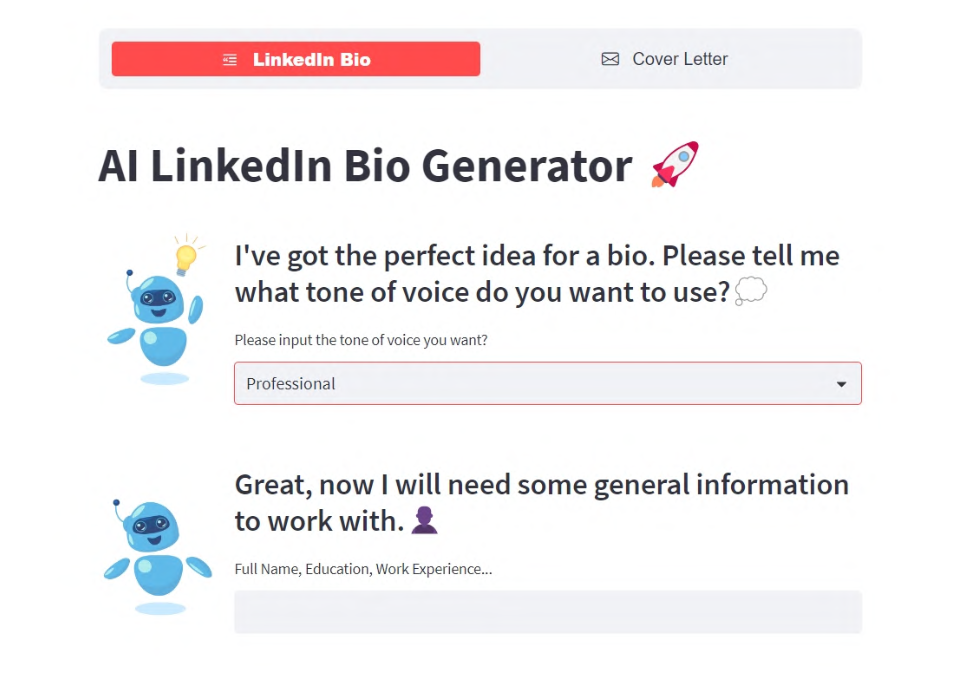

# MakkerAI

## MakkerAI is an automatic generator of Bio, Cover Letter, and CV.




Reduces the effort of writing with a nice UI that guides you step by step.

The app takes care of designing the right prompt, so the AI generates content concise, engaging and personalized. 

Project realized for [Build your AI Startup Hackathon Episode 2](https://lablab.ai/event/ai-startup-hackathon-episode-2)

A more detailed description of technology and use cases in available in [this presentation](MakkerAI.pdf).

To try the demo just run `Makker.py` with the command `streamlit run`
```
  streamlit run Makker.py
```


